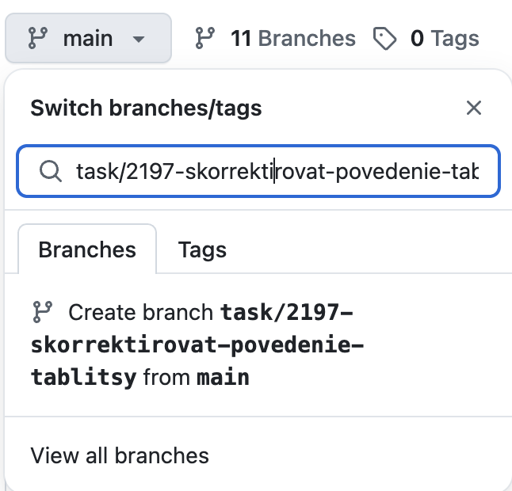
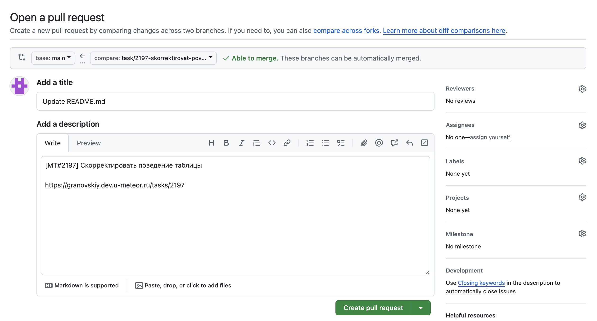

# Интеграция с GitHub

Интеграция позволяет создавать ветки GitHub прямо из интерфейса METEOR.

## Отображение в задаче

1. Вкладка "**GitHub**" - будет отображать следующие данные из gitHub:

* Все связанные Pull Requests с их статусами (Открыт, Объединен, Закрыт, Черновик);

<figure><figcaption></figcaption></figure>

* Статус GitHub Actions (success, queued, in\_progress, action\_required, failure, neutral, skipped, cancelled, timed\_out);

<figure><figcaption>
GitHub Actions
</figcaption></figure>

* Связь между задачами и Pull Requests (отношение n:m, задача может быть связана с несколькими Pull Requests, а Pull Requests — с несколькими задачами).

2. Вкладка "**История**" - будет отображать изменения по PR (обновления статусов, изменение описания PR):

<figure><figcaption></figcaption></figure>

## Настройка интеграции

### METEOR

1.  Создайте специальную [роль](../polzovateli-zapolniteli-i-gruppy/roli-i-prava/roli.md), в которой будут как минимум два права:

    * "Просмотр задач";
    * "Добавление комментариев".

    &#x20;_(Администрирование -> Пользователи и права -> Роли -> Конкретная роль -> раздел "Задачи")_

<figure><figcaption></figcaption></figure>

2.  Создайте [пользователя](../polzovateli-zapolniteli-i-gruppy/polzovateli.md) для интеграции

    * &#x20;назначьте ему созданную роль;
    * добавьте этого пользователя во все проекты, где нужна интеграция с GitHub.

    _(Администрирование -> Пользователи и права -> Пользователи)_

<figure><figcaption></figcaption></figure>

3. Сгенерируйте API-токен для этого пользователя (он понадобится вам на стороне GitHub). Для генерации токена необходимо:
   * войдите в систему под учётной записью нового пользователя.
   * перейдите в **Профиль** (нажмите на аватарку в правом верхнем углу и выберите Профиль).
   * далее "**Токены доступа**".
   * нажмите на кнопку "+ Токен API".


**Важно!** Обязательно скопируйте сгенерированный токен и надёжно сохраните его. Токен нельзя будет посмотреть позже!


4. Активируйте модуль GitHub в [настройках проекта](../../rukovodstvo-polzovatelya/proekty/nastroiki-proekta.md#moduli-proekta) (_Настройки проекта -> Модули)_.
5. Выдайте права на просмотр вкладки "**GitHub**" нужным [ролям](../polzovateli-zapolniteli-i-gruppy/roli-i-prava/):
   * "Показывать содержимое GitHub".

### Настройка GitHub

1. Создайте webhook для каждого репозитория:

* Content-Type: application/json
* URL: https://mycompany.u-meteor.ru/op/webhooks/github?key=ВАШ\_ТОКЕН
* События: "Send me everything"

<figure><figcaption></figcaption></figure>

Интеграция готова к использованию!

## Использование интеграции с GitHub

### Создание ветки

1. Откройте вкладку GitHub в карточке задачи;
2. Нажмите "Git-сниппеты";
3. Скопируйте имя ветки:

<figure><figcaption></figcaption></figure>

4. В Git-клиенте создайте ветку с этим именем:

<figure><figcaption></figcaption></figure>

### Создание коммита

1. METEOR предлагает шаблон сообщения коммита на основе задачи:

<figure><figcaption></figcaption></figure>

2. В GitHub создайте коммит с этим описанием (Extended description):

<figure><figcaption></figcaption></figure>

### Cоздание Pull Request

Для того, чтобы связать Pull Request с задачей METEOR, в описании Pull Request должна быть:

* ссылка на задачу,  ранее скопированная из METEOR (при условии, что коммит только один);
* или укажите «МТ#ID», где ID - это идентификатор задачи METEOR, в описании. Например, MT#2197. Данные о PR подтянутся в METEOR и будут отображаться на вкладке "**GitHub**".


**Обратите внимание**, что «МТ#ID» чувствителен к регистру. «мт#ID» - не будет работать.


<figure><figcaption></figcaption></figure>

Если коммит не один, то при создании Pull Request необходимо в описание вручную указать данные из METEOR (MT#ID или ссылка на задачу, ранее скопированная из METEOR).

Статусы Pull Request на вкладке "**GitHub**" в METEOR обновляются автоматически.

### Создать ветку с пустым коммитом

Из-за ограничения в один коммит или если есть необходимость создавать ветку как можно раньше, в меню «**Git-сниппеты**» можно создать пустой коммит. По кнопке «**Создать ветку с пустым коммитом**», который создаст ветку и добавит в неё пустой коммит с помощью одной команды.

<figure><figcaption></figcaption></figure>

