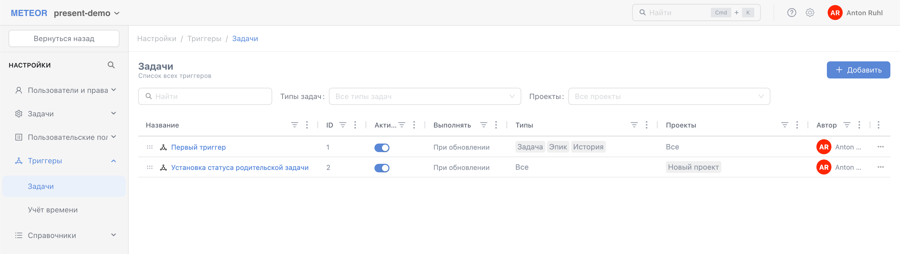
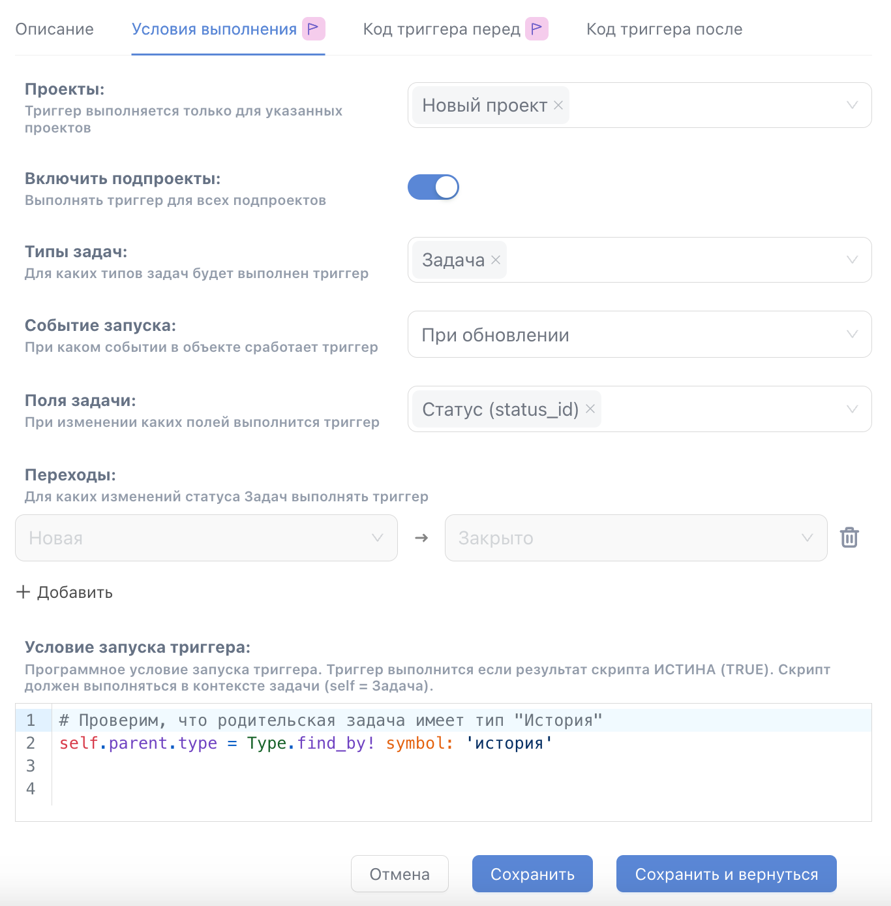
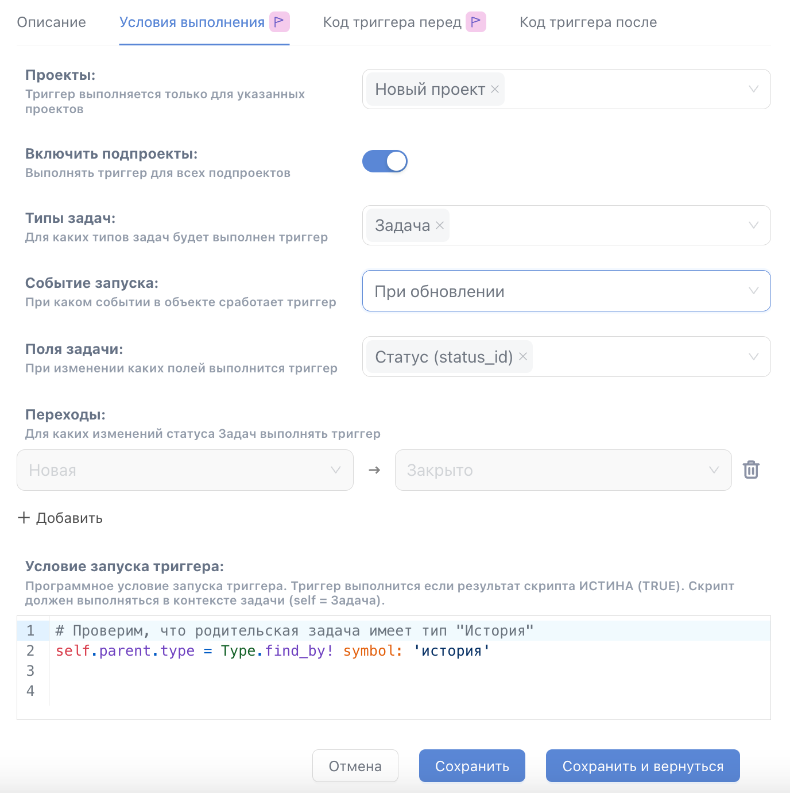
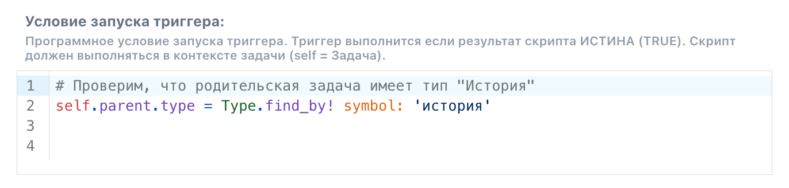
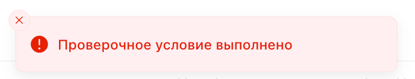
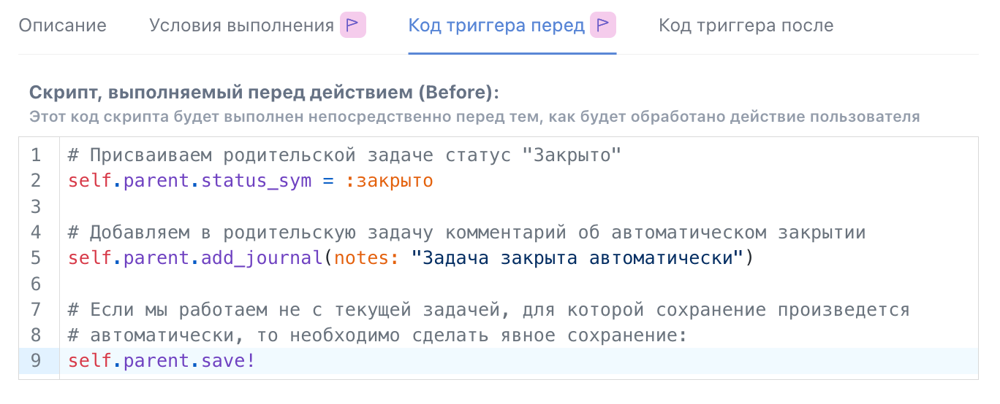

# Триггеры задач

Особенность триггеров задач заключается в том, что область их действия ограничена сущностью "задача". Это означает, что триггеры будут срабатывать только в рамках задач, обеспечивая более точное и контекстное выполнение заданных условий.

## Список триггеров задач

Чтобы перейти в список всех существующих в системе триггеров задач в панели администрирования выберите "Администрирование" -> "Триггеры" -> "Задачи".

<figure><figcaption></figcaption></figure>

Вы увидите список всех триггеров задач и основные их реквизиты:

* Название триггера\
  Короткое название, описывающее суть задачи, решаемой триггером.
* ID\
  Уникальный идентификатор триггера -  назначается автоматически при создании.
* Событие запуска\
  Указывает на какое событие настроен триггер. Подробнее о событиях запуска триггеров можете ознакомиться в главе [События запуска](sobytiya-zapuska.md).
* Активен\
  Признак активности триггера. Если отключено, то триггер не будет запускаться.
* Типы задач\
  Указывает на работу с какими типами задач настроен триггер.&#x20;
* Проекты\
  В каких проектах разрешен запуск триггера.
* Автор\
  Пользователь, создавший триггер.

Над списком триггеров есть поля фильтрации по типам задач и проектам, а также поиск по названию триггера.


Важно! Если для какой либо задачи в системе по критериям запуска подходит два или более триггера, то запускаться они будут именно в том порядке, в котором отображены в таблице с отключенными сортировками.


Перемещайте триггеры относительно друг друга, чтобы изменить порядок их запуска.

<figure><figcaption><p>изменение порядка запуска триггеров</p></figcaption></figure>


## Форма триггера задач

Для создания нового триггера нажмите кнопку "**+ Добавить**" сверху списка триггеров.

Если вы хотите изменить существующий триггер, то кликните на его названии в списке.

После этого откроется форма триггера, состоящая из нескольких вкладок:

### Описание

На этой вкладке можно указать название триггера, включить или отключить его (сделать активным), активировать режим отладки, а также увидеть даты создания и последнего обновления триггера. Также здесь доступно поле для добавления описания триггера, которое поможет лучше понять его назначение и использование.

<figure><figcaption><p>Вкладка Описание</p></figcaption></figure>

Рекомендации по заполнению данных о триггере:

1. **Название триггера**: Выберите короткое и информативное название, которое чётко отражает суть действия триггера, чтобы было легко понять его назначение.
2. **Включение/Отключение триггера (Активность)**: Включайте триггер только тогда, когда он полностью настроен и готов к использованию. Если необходимо временно приостановить его действие, используйте опцию отключения.
3. **Режим отладки**: Активируйте режим отладки для тестирования работы триггера. Это позволит получить расширенный вывод ошибок работы триггера включая стек вызовов и выявить возможные ошибки перед запуском в рабочей среде.
4. **Описание триггера**: Заполните поле описания максимально детально, указав, для каких целей создан триггер и какие условия или события активируют его. Это облегчит понимание его работы для вас и ваших коллег.
5. **Даты создания и обновления**: Следите за актуальностью триггера и, при необходимости, фиксируйте важные изменения в описании, чтобы история обновлений была понятной.

Эти рекомендации помогут вам эффективно настроить триггер и поддерживать его актуальность в процессе работы.

### Условия выполнения

На этой вкладке настраиваются параметры, от которых будет зависеть, когда и как триггер будет запускаться.

<figure><figcaption><p>Учловия выполнения</p></figcaption></figure>

Поля вкладки:

* Проекты - здесь указывается проект (проекты), для задач которого будет возможен запуск триггера. Если ничего не указывать триггер будет запускаться для задач из любых проектов, в том числе шаблонов;
* Включить подпроекты - должен ли триггер выполняться только в указанном проекте (проектах), или необходим запуск во всех его подпроектах в том числе.


Эта опция полезна, если вы часто создаете новые подпроекты. При включенной опции для родительского проекта, триггер автоматически будет запускаться для всех создаваемых подпроектов.


* Типы задач - здесь вы можете указать для каких типов задач будет осуществлен запуск триггера;
* Событие запуска - в какой момент должен выполняться триггер;
  * При создании - выполняется только в момент создания задачи;
  * При сохранении - при создании и каждом обновлении задачи;
  * При обновлении - при каждом обновлении задачи;
  * При удалении - только при удалении задачи;
  * Вручную - запуск триггера возможен только вручную нажатием кнопки "Запустить"
  * По расписанию - триггер будет запускаться по расписанию


Детальное описание событий запуска приведено в главе [События запуска](sobytiya-zapuska.md)


### Запуск  "При создании", "При сохранении", "При обновлении" и "При удалении"

Если выбрано события запуска "**При сохранении**" и "**При обновлении**", то дополнительно вы сможете настроить изменения каких именно полей запустят триггер.

Для событий запуска "**При создании**" и "**При удалении**" настроек полей не требуется, поэтому они не будут выведены на форму.

Итак:

* Поля задачи - в этом поле вы можете указать, при изменении каких полей выполняется триггер. Актуально для триггеров на события: обновление и сохранение;

Если выбрано события запуска "**При сохранении**" и "**При обновлении**" и в поле "Поля задачи" выбрать системный реквизит "**Статус**", то вы сможете детализировать, при каких **переходах** с одного статуса в другой должен выполняться триггер:

<figure><figcaption><p>Указан переход из статуса "Новая" в статус "Закрыто", на который запустится триггер</p></figcaption></figure>

Подытожим:

* Переходы - если в "Поля задачи" выбран Статус, то в этом блоке вы сможете перечислить все переходы, на которые должен запуститься триггер. Если ни один переход не выбран, то триггер будет запускаться при любых переходах. Если с любой стороны перехода выбрать "_Любой статус_", то переход будет контролироваться только по стороне с указанным статусом;

И последнее поле на этой вкладке:

* Условие запуска триггера - программное условие запуска триггера, которое невозможно описать в полях настроек. На изображении показан пример, в котором проверяется тип родительской задачи:

<figure><figcaption><p>Программно описанное проверочное условие</p></figcaption></figure>


**Совет:**&#x20;

При разработке триггеров мы рекомендуем сначала описывать преверочные условия, если у вас есть в них потребность.&#x20;

Чтобы убедиться в работоспособности проверочнного условия на вкладке "**Код триггера**" или "**Код триггера перед**" временно создайте код-заглушку:

```
# Код-заглушка для отладки проверочного условия
show_error("Проверочное условие выполнено")
```

Это полезно тем, что данный код останавливает сохранение задачи, позволяя вам многократно проводить тестирование без необходимости откатывать изменения. Кроме того, вы получите наглядное подтверждение работоспособности вашего кода, что упрощает процесс проверки и отладки.





### Запуск "Вручную"

Выбор события запуска "Вручную" добавит на форму поле "Фильтры (JSON)". Это еще один способ описать отбор задач для обработки триггером.&#x20;

Подробнее о JSON формате фильтров вы можете ознакомиться в API документации вашего экземпляра, которая находится по адресу https://<адрес\_вашего\_экземпляра>.u-meteor.ru/op/api/docs/ru#?route=tag--Фильтры

Пример JSON-фильтра:

```ruby
# 1. filters
# открытые задачи у которых дата последнего изменения статуса более 7 дней
[
    {
        "status":{
            "operator":"o",
            "values":[]
        }
    },
    {
        "statusUpdatedAt":{
            "operator":"<t-",
            "values":["7"]
        }
    }
]
```

Запуск таких триггеров осущетсвляется только по нажатию кнопок "Запустить триггер" в списке триггеров и на форме триггера.

### Запуск "По расписанию"

Триггеры с событием запуска "По расписанию" добавляет поле "Фильтры (JSON)", которое описано в главе [выше](triggery-zadach.md#zapusk-vruchnuyu).

Помимо этого на форме появятся поля:

* Часовой пояс\
  Здесь указывается по времени какого часового пояса будет обрабатываться указанно ниже cron-выражение. Часовые пояса выбираются из списка:

<figure><figcaption></figcaption></figure>

* Cron-выражение\
  В этом поле прописывается cron-выражение для указания расписания. Подробнее о cron-выражениях можно узнать здесь - [https://ru.wikipedia.org/wiki/Cron](https://ru.wikipedia.org/wiki/Cron) или здесь - [https://crontab.guru/](https://crontab.guru/), а примеры выражений можно увидеть еще здесь - [https://crontab.guru/examples.html](https://crontab.guru/examples.html)

### Код триггера

На этой вкладке располагается код триггера, если выбраны события запуска "При создании", "При удалении", "Вручную" или "По расписанию"

### Код триггера перед

Эта вкладка доступна только для событий запуска "При сохранении" и "При обновлении".

Код на этой вкладке будет выполнен непосредственно перед тем, как будет обработано действие пользователя над задачей.

Пример:

<figure><figcaption><p>Код триггера перед (before)</p></figcaption></figure>

### Код триггера после

Эта вкладка доступна только для событий запуска "При сохранении" и "При обновлении".

Код на этой вкладке будет выполнен сразу после того, как будет обработано действие пользователя.


Планируйте ваши сценарии выполнения триггеров таким образом, чтобы не нарушалась консистентность данных (согласованность данных).&#x20;

Примеры триггеров, которые нарушают консистентность данных и могут попасть в циклическое выполнение из-за неправильной настройки типа запуска "перед" (before) или "после" (after):&#x20;

1. **Триггер на обновление статуса задачи**:&#x20;
   1. **Условие**: Когда происходит изменение статуса на "К выполнению".&#x20;
   2. **Действие**: Автоматически обновить статус. Если приоритет "Низкий", то установить статус "К выполнению", если другой приоритет - установить статус "В работе".&#x20;
   3. **Запуск**: Триггер настроен на запуск после обновления задачи.&#x20;

**Проблема**: Триггер срабатывает после изменения статуса задачи и сам формирует изменение статуса, которое попадает под условие запуска. Работа триггера приводит к повторному обновлению задачи, что снова активирует тот же триггер. В результате происходит циклическое выполнение: обновление статуса → повторное обновление задачи → повторное изменение статуса и т.д.&#x20;

2. Триггер на изменение поля задачи:&#x20;
   1. **Условие**: Когда поле "Описание" изменено.&#x20;
   2. **Действие**: Автоматически обновить поле "Ответственный".&#x20;
   3. **Запуск**: Триггер настроен на срабатывание до изменения поля "Описание".&#x20;

**Проблема**: Если в результате изменения поля "Ответственный" срабатывает другой триггер, который вносит правки в поле "Описание", это снова активирует исходный триггер, что вызывает бесконечный цикл обновлений.&#x20;

**Решение**: Важно корректно выбирать тип запуска триггера — "до" (before) или "после" (after)

В METEOR предусмотрена защита от появления простых и транзитивных циклов. Но в этом случае разработчик триггера не будет понимать что происходит, так как система защиты заблокирует выполнение триггеров, участвующих в цикле через некоторое время.



## Полезная информация

Мы понимаем что разработка триггеров непростая задача. Чтобы вам было проще разрабатывать вашу автоматизацию на базе триггеров, мы подготовили [Руководство по разработке триггеров](../../rukovodstvo-po-triggeram/) и будем постоянно его дополнять и снабжать новыми примерами реализаций сценариев.&#x20;

Наши специалисты могут помочь вам в разработке триггеров как консультативно, так и комплексно. Вы можете обратиться к нам с запросом на реализацию автоматизации по вашим сценариям.&#x20;
