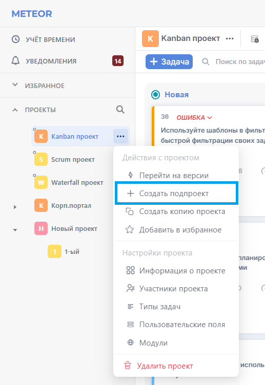

# Типы задач

## Просмотр типов задач

Перейдите в раздел "**Администрирование**" в верхней части экрана:

<figure><figcaption></figcaption></figure>

В разделе **Задачи** выберите пункт "**Типы задач**":

<figure><figcaption></figcaption></figure>

В открывшемся окне отобразится список всех доступных типов задач в вашем экземпляре METEOR.

<figure><figcaption></figcaption></figure>

## Добавление типа задачи


Добавлять, изменять типы задач могут пользователи с соответствующими правами в глобальной роли. Подробнее о ролях можно прочесть в статье "[Роли](../polzovateli-zapolniteli-i-gruppy/roli-i-prava/roli.md)".


Для добавления нового типа задачи нажмите "**+ Добавить**". В открывшемся окне настройте новый тип:

* Название - название нового типа (обязательное поле);


В названии типа задачи разрешены латинские и кириллические буквы, цифры и знак нижнего подчеркивания.


* Символ - идентификатор нового типа задачи, заполняется автоматически на основании названия;
* Цвет - цвет для визуального выделения типа задачи в представлениях задач ([досках](../../rukovodstvo-polzovatelya/doski/), [списках](../../rukovodstvo-polzovatelya/spiski-zadach/), [диаграмме Ганта](../../rukovodstvo-polzovatelya/diagramma-ganta/));
* По умолчанию - если выбрать этот параметр, то тип задачи будет автоматически добавляться во все новые проекты (для вашей версии METEOR возможен один тип задачи по умолчанию);
* Это веха - признак того, что данный тип будет являться вехой проекта. Веха не имеет продолжительности и не может иметь подзадач;
* Отображать в [дорожной карте](../../rukovodstvo-polzovatelya/dorozhnaya-karta.md) по умолчанию - разрешение на отображение этого типа задач в дорожной карте;
* Копировать [рабочий поток](rabochie-potoki.md) из - настройки рабочего потока из существующего типа  задач.

<figure><figcaption></figcaption></figure>

Для создания типа задачи воспользуйтесь кнопкой "**Создать**" в нижней части окна. После создания типа появится возможность [настроить форму](tipy-zadach.md#nastroika-formy) и [рабочий поток](tipy-zadach.md#nastroiki-rabochego-potoka).

## Добавление типа задачи в проект

В [настройках проекта](../../rukovodstvo-polzovatelya/proekty/nastroiki-proekta.md#tipy-zadach) во вкладке "**Типы задач**" активируйте необходимые типы задач.

<figure><figcaption></figcaption></figure>

## Изменение типа задачи

Откройте необходимый тип задания двойным кликом по нему или через кнопку "**Редактировать**" в списке:

<figure><figcaption></figcaption></figure>

Для корректировки рабочего потока, связанного с указанным типом, воспользуйтесь кнопкой "**Рабочие потоки**" в списке всех доступных типов задач:

<figure><figcaption></figcaption></figure>

## Настройка формы

Настройте разделы и поля для типа задачи во вкладке "**Настройка формы**".

<figure><figcaption></figcaption></figure>

## Настройки рабочего потока

Настройте рабочий поток с нуля или скопируйте его из другого типа задачи во вкладке "**Рабочие потоки**". Подробное описание по настройке можно найти на странице "[Рабочие потоки](rabochie-potoki.md)".

<figure><figcaption></figcaption></figure>

## Копирование типа задачи

Копировать тип задачи можно по кнопке "**Копировать**" в контекстном меню в списке всех типов задач:

<figure><figcaption></figcaption></figure>

## Удаление типа задачи

Для удаления типа задачи в списке всех типов воспользуйтесь кнопкой "**Удалить**", в контекстном меню:

<figure><figcaption></figcaption></figure>

Удаление возможно, только если еще не созданы задачи данного типа. В противном случае система выдаст ошибку:

<figure><figcaption></figcaption></figure>
